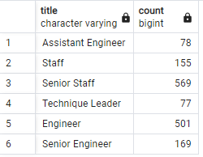
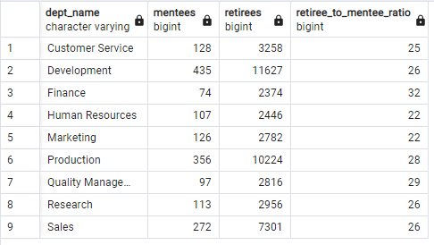

# Pewlett-Hackard-Analysis

## Overview of the Analysis

The purpose of this analysis is to complete Bobby's manager's additional assignments:
* Determine the number of retiring employees per title
* Identify employees who are eligible to participate in a mentorship program
Finally, a report will be created that summarizes the analysis and helps prepare Bobby’s manager for the “silver tsunami” as many current employees reach retirement age.

## Results

### Deliverable 1

* In total, there are 41,380 retirement-ready employees.
* On average, retirement-ready employees held 1.85 titles throughout their careers.
* Retirement-ready employees represented 7 unique retiring titles.
* Of the retirement-ready employees within the 7 unique retiring titles, over 70% have senior-level titles.

#### Retirement Titles Table

#### Unique Titles Table

#### Retiring Titles Table

### Deliverable 2

* There are 1,549 employees who are eligible for mentorship.
* There are 26.71 times more retirees than mentorship-eligible employees.
* With the following query we can see that mentorship-eligible employees represent 6 titles

`SELECT me.title, COUNT(me.emp_no)
FROM mentorship_eligibility as me
GROUP BY me.title;`

* The most common title among mentorship-eligible employees is *Senior Staff*

#### Mentee Counts by Title

#### Mentorship Eligibility Table

## Summary

### How many roles will need to be filled as the "silver tsunami" begins to make an impact?

Retirement-ready employees make up 13.8% of the company's total number of employees. To maintain the same employee population, a maximum of 41,380 positions will need to be filled by 41,380 new hires. This number will be fewer if a smaller percent of retirement-ready employees actually retire.

### Are there enough qualified, retirement-ready employees in the departments to mentor the next generation of Pewlett Hackard employees?

There are 1,549 employees eligible for mentorship, and 41,380 retirement-ready employees. However, in order for each mentorship-eligible employee to have a qualified mentor within their own department, additional exploration is needed. Here we find the ratio of Retirement-ready employees to employees eligible for mentorship for each department:

`SELECT m.dept_name, m.mentees, r.retirees, r.retirees/m.mentees AS retiree_to_mentee_ratio
FROM (
    SELECT d.dept_name, COUNT(de.emp_no) AS mentees
    FROM dept_emp as de
    INNER JOIN departments as d
    ON de.dept_no = d.dept_no
    INNER JOIN mentorship_eligibility as me
    ON de.emp_no = me.emp_no
    GROUP BY d.dept_name
) AS m
INNER JOIN (
    SELECT d.dept_name, COUNT(de.emp_no) AS retirees
    FROM dept_emp as de
    INNER JOIN departments as d
    ON de.dept_no = d.dept_no
    INNER JOIN retirement_info as ri
    ON de.emp_no = ri.emp_no
    GROUP BY d.dept_name
) AS r
ON m.dept_name = r.dept_name;`

#### Ratio of retirees to mentees
