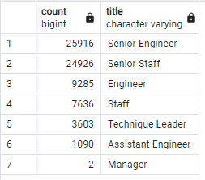

# Pewlett-Hackard-Analysis

## Overview of the Analysis

The purpose of this analysis is to complete Bobby's manager's additional assignments:
* Determine the number of retiring employees per title
* Identify employees who are eligible to participate in a mentorship program
Finally, a report will be created that summarizes the analysis and helps prepare Bobby’s manager for the “silver tsunami” as many current employees reach retirement age.

## Results

### Deliverable 1

* In total, there are 72,458 retirees.
* On average, retirees held 1.85 titles.
* Retirees represented 7 unique retiring titles.
* Of the retirees within the 7 unique retiring titles, over 70% have senior-level titles.

#### Retirement Titles Table

#### Unique Titles Table

#### Retiring Titles Table

### Deliverable 2

* 
* 
* 
* 

## Summary

### How many roles will need to be filled as the "silver tsunami" begins to make an impact?

### Are there enough qualified, retirement-ready employees in the departments to mentor the next generation of Pewlett Hackard employees?
